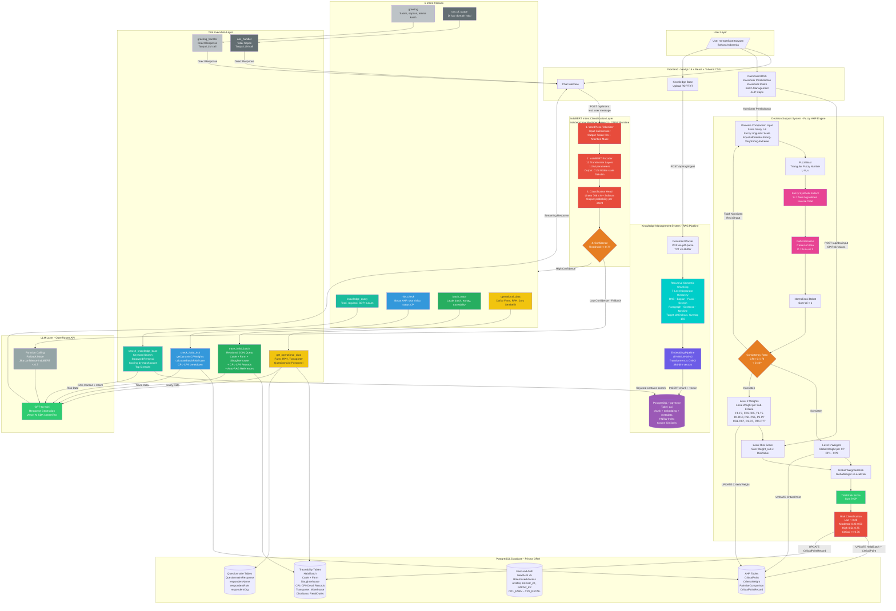

# Arsitektur Lama (Beserta Code)

Berikut adalah arsitektur sistem lama (sebelum penambahan LightGBM & SHAP), lengkap beserta *source code* Mermaid-nya.

## Diagram Arsitektur



## Source Code Mermaid

Jika diperlukan raw code untuk di-copy, berikut adalah kode sumbernya:

```text
flowchart TB
    subgraph USER["User Layer"]
        U[/"User mengetik pertanyaan\nBahasa Indonesia"/]
    end

    subgraph FRONTEND["Frontend - Next.js 15 + React + Tailwind CSS"]
        UI["Chat Interface"]
        DASH["Dashboard DSS\nKuesioner Pembobotan\nKuesioner Risiko\nBatch Management\nAHP Steps"]
        KB_UI["Knowledge Base\nUpload PDF/TXT"]
    end

    subgraph INTENT["IndoBERT Intent Classification Layer\nindobenchmark/indobert-base-p1 - ONNX Runtime"]
        TOK["1. WordPiece Tokenizer\nInput: kalimat user\nOutput: Token IDs + Attention Mask"]
        BERT["2. IndoBERT Encoder\n12 Transformer Layers\n110M parameters\nOutput: CLS hidden state 768-dim"]
        CLS_HEAD["3. Classification Head\nLinear 768 x 6 + Softmax\nOutput: probability per intent"]
        CONF{"4. Confidence\nThreshold >= 0.7?"}
    end

    subgraph CLASSES["6 Intent Classes"]
        I1["knowledge_query\nTeori, regulasi, SOP, hukum"]
        I2["risk_check\nBobot AHP, skor risiko, status CP"]
        I3["batch_trace\nLacak batch, eartag, traceability"]
        I4["operational_data\nDaftar Farm, RPH, Juru Sembelih"]
        I5["greeting\nSalam, sapaan, terima kasih"]
        I6["out_of_scope\nDi luar domain halal"]
    end

    subgraph LLM_BOX["LLM Layer - OpenRouter API"]
        LLM["GPT-4o-mini\nResponse Generation\nVercel AI SDK streamText"]
        FC["Function Calling\nFallback Mode\nJika confidence IndoBERT < 0.7"]
    end

    subgraph TOOLS["Tool Execution Layer"]
        T1["search_knowledge_base\nKeyword Search\nStopword Removal\nScoring by match count\nTop 5 results"]
        T2["check_halal_risk\ngetDynamicCPWeights\ncalculateBatchRiskScore\nCP1-CP9 breakdown"]
        T3["trace_halal_batch\nRelational JOIN Query\nCattle + Farm + Slaughterhouse\n+ CP1-CP9 Records\n+ Auto-RAG References"]
        T4["get_operational_data\nFarm, RPH, Transporter\nQuestionnaire Personnel"]
        T5["greeting_handler\nDirect Response\nTanpa LLM call"]
        T6["oos_handler\nTolak Sopan\nTanpa LLM call"]
    end

    subgraph KMS["Knowledge Management System - RAG Pipeline"]
        PDF["Document Parser\nPDF via pdf-parse\nTXT via Buffer"]
        CHUNK["Recursive Semantic Chunking\n7-Level Separator Hierarchy\nBAB - Bagian - Pasal - Section\nParagraph - Sentence - Newline\nTarget 1000 chars, Overlap 150"]
        EMB["Embedding Pipeline\nall-MiniLM-L6-v2\nTransformers.js ONNX\n384-dim vectors"]
        VDB[("PostgreSQL + pgvector\nTabel: oai\nchunk + embedding + metadata\nHNSW Index\nCosine Similarity")]
    end

    subgraph DSS["Decision Support System - Fuzzy AHP Engine"]
        PW["Pairwise Comparison Input\nSkala Saaty 1-9\nFuzzy Linguistic Scale\nEqual-Moderate-Strong-VeryStrong-Extreme"]
        TFN["Fuzzifikasi\nTriangular Fuzzy Number\nl, m, u"]
        FSE["Fuzzy Synthetic Extent\nSi = Sum Mgi otimes Inverse Total"]
        COA["Defuzzification\nCenter of Area\nD = l+m+u / 3"]
        NORM["Normalisasi Bobot\nSum Wi = 1"]
        CR_CHECK{"Consistency Ratio\nCR = CI / RI\n< 0.10?"}
        L1_W["Level 1 Weights\nGlobal Weight per CP\nCP1 - CP9"]
        L2_W["Level 2 Weights\nLocal Weight per Sub-Kriteria\nF1-F7, FD1-FD5, T1-T5\nR1-R10, PS1-PS5, P1-P7\nCS1-CS7, D1-D7, RT1-RT7"]
        LOCAL["Local Risk Score\nSum Weight_sub x RiskValue"]
        GLOBAL["Global Weighted Risk\nGlobalWeight x LocalRisk"]
        TOTAL["Total Risk Score\nSum 9 CP"]
        RISK_CLASS["Risk Classification\nLow < 0.26\nModerate 0.26-0.50\nHigh 0.51-0.75\nCritical >= 0.76"]
    end

    subgraph DB["PostgreSQL Database - Prisma ORM"]
        DB_T[("Traceability Tables\nHalalBatch\nCattle + Farm\nSlaughterhouse\nCP1-CP9 Detail Records\nTransporter, Warehouse\nDistributor, RetailOutlet")]
        DB_A[("AHP Tables\nCriticalPoint\nCriteriaWeight\nPairwiseComparison\nCriticalPointRecord")]
        DB_U[("User and Auth\nNextAuth v5\nRole-based Access\nADMIN, PAKAR_K1, PAKAR_K2\nCP1_FARM - CP9_RETAIL")]
        DB_Q[("Questionnaire Tables\nQuestionnaireResponse\nrespondentName\nrespondentRole\nrespondentOrg")]
    end

    U --> UI
    U --> DASH
    U --> KB_UI

    UI -->|"POST /api/intent\ntext: user message"| TOK
    TOK --> BERT
    BERT --> CLS_HEAD
    CLS_HEAD --> CONF

    CONF -->|"High Confidence"| CLASSES
    CONF -->|"Low Confidence - Fallback"| FC

    I1 --> T1
    I2 --> T2
    I3 --> T3
    I4 --> T4
    I5 --> T5
    I6 --> T6

    T1 -->|"Keyword contains search"| VDB
    T2 --> DB_A
    T3 --> DB_T
    T4 --> DB_T
    T4 --> DB_Q

    T1 -->|"RAG Context + Intent"| LLM
    T2 -->|"Risk Data"| LLM
    T3 -->|"Trace Data"| LLM
    T4 -->|"Entity Data"| LLM
    FC --> LLM

    T5 -->|"Direct Response"| UI
    T6 -->|"Direct Response"| UI
    LLM -->|"Streaming Response"| UI

    KB_UI -->|"POST /api/rag/ingest"| PDF
    PDF --> CHUNK
    CHUNK --> EMB
    EMB -->|"INSERT chunk + vector"| VDB

    DASH -->|"POST /api/dss/input\nCP Risk Values"| LOCAL
    DASH -->|"Kuesioner Pembobotan"| PW
    PW --> TFN
    TFN --> FSE
    FSE --> COA
    COA --> NORM
    NORM --> CR_CHECK
    CR_CHECK -->|"Konsisten"| L1_W
    CR_CHECK -->|"Konsisten"| L2_W
    CR_CHECK -->|"Tidak Konsisten\nRevisi Input"| PW

    L2_W --> LOCAL
    LOCAL --> GLOBAL
    L1_W --> GLOBAL
    GLOBAL --> TOTAL
    TOTAL --> RISK_CLASS

    L1_W -->|"UPDATE CriticalPoint"| DB_A
    L2_W -->|"UPDATE CriteriaWeight"| DB_A
    RISK_CLASS -->|"UPDATE HalalBatch + CriticalPoint"| DB_A
    RISK_CLASS -->|"UPDATE CriticalPointRecord"| DB_T

    style TOK fill:#e74c3c,color:#fff
    style BERT fill:#e74c3c,color:#fff
    style CLS_HEAD fill:#e74c3c,color:#fff
    style CONF fill:#e67e22,color:#fff
    style LLM fill:#2ecc71,color:#fff
    style FC fill:#95a5a6,color:#fff
    style I1 fill:#1abc9c,color:#fff
    style I2 fill:#3498db,color:#fff
    style I3 fill:#27ae60,color:#fff
    style I4 fill:#f1c40f,color:#333
    style I5 fill:#bdc3c7,color:#333
    style I6 fill:#636e72,color:#fff
    style T1 fill:#1abc9c,color:#fff
    style T2 fill:#3498db,color:#fff
    style T3 fill:#27ae60,color:#fff
    style T4 fill:#f1c40f,color:#333
    style T5 fill:#bdc3c7,color:#333
    style T6 fill:#636e72,color:#fff
    style VDB fill:#9b59b6,color:#fff
    style FSE fill:#e84393,color:#fff
    style COA fill:#e84393,color:#fff
    style CR_CHECK fill:#e67e22,color:#fff
    style RISK_CLASS fill:#e74c3c,color:#fff
    style TOTAL fill:#2ecc71,color:#fff
    style EMB fill:#6c5ce7,color:#fff
    style CHUNK fill:#00cec9,color:#fff
```
