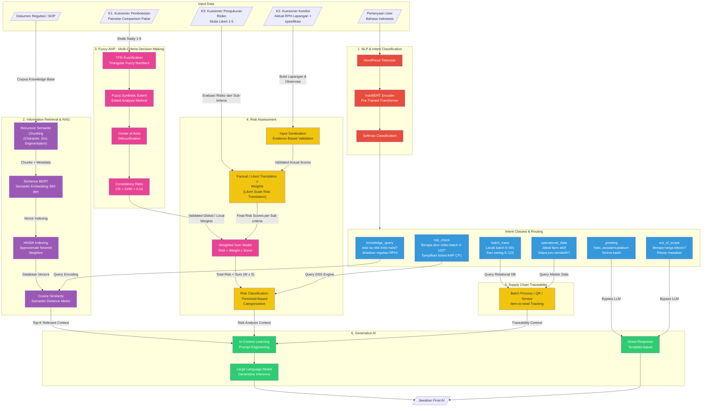

# Arsitektur Lama

Berikut adalah flow arsitektur lama sesuai dengan gambar yang dikirimkan. Sesuai permintaan, file ini juga memuat *source code* Mermaid-nya (codingnya) agar dapat diedit atau dicopy.

## Diagram Arsitektur



## Source Code Mermaid

```text
flowchart TD
    subgraph InputData["Input Data"]
        direction LR
        A1[/"Dokumen Regulasi / SOP"/]
        A2[/"K1: Kuesioner Pembobotan\nPairwise Comparison Pakar"/]
        A3[/"K2: Kuesioner Kondisi\nAktual RPH Lapangan +\nspesifikasi"/]
        A4[/"K3: Kuesioner Pengukuran\nRisiko\nSkala Likert 1-5"/]
        A5[/"Pertanyaan User\nBahasa Indonesia"/]
    end

    subgraph NLP["1. NLP & Intent Classification"]
        B1["WordPiece Tokenizer"]
        B2["IndoBERT Encoder\nPre-Trained Transformer"]
        B3["Softmax Classification"]
    end
    
    A5 --> B1
    B1 --> B2 --> B3

    subgraph Intent["Intent Classes & Routing"]
        direction LR
        C1["knowledge_query\nAda isu titik kritis halal?\nJelaskan regulasi RPH!"]
        C2["risk_check\nBerapa skor risiko batch X-\n102?\nTampilkan bobot AHP CP1"]
        C3["batch_trace\nLacak batch E-001\nDari eartag E-123"]
        C4["operational_data\nJdwal farm aktif\nSiapa juru sembelih?"]
        C5["greeting\nHalo, assalamualaikum\nTerima kasih"]
        C6["out_of_scope\nBerapa harga bitcoin?\nResep masakan"]
    end
    
    B3 --> Intent

    subgraph RAG["2. Information Retrieval & RAG"]
        D1["Recursive Semantic\nChunking\n(Character, Doc,\nSegmentation)"]
        D2["Sentence BERT\nSemantic Embedding 384-\ndim"]
        D3["HNSW Indexing\nApproximate Nearest\nNeighbor"]
        D4["Cosine Similarity\nSemantic Distance Metric"]
    end
    
    A1 -->|"Corpus Knowledge Base"| D1
    D1 -->|"Chunks + Metadata"| D2
    D2 -->|"Vector Indexing"| D3
    D3 -->|"Database Vectors"| D4

    C1 -->|"Query Encoding"| D4

    subgraph AHP["3. Fuzzy AHP - Multi-Criteria Decision Making"]
        E1["TFN Fuzzification\nTriangular Fuzzy Numbers"]
        E2["Fuzzy Synthetic Extent\nExtent Analysis Method"]
        E3["Center of Area\nDefuzzification"]
        E4["Consistency Ratio\nCR = CI/RI < 0.10"]
    end
    
    A2 -->|"Skala Saaty 1-9"| E1
    E1 --> E2 --> E3 --> E4

    subgraph Risk["4. Risk Assessment"]
        F1["Input Sanitization\nEvidence Based Validation"]
        F2["Factual / Likert Translation x\nWeights\n(Likert Scale Risk Translation)"]
        F4["Weighted Sum Model\nRisk = Weight x Score"]
        F5["Risk Classification\nThreshold-Based\nCategorization"]
    end
    
    A3 -->|"Bukti Lapangan &\nObservasi"| F1
    A4 -->|"Evaluasi Risiko dan Sub-\nkriteria"| F2
    E4 -->|"Validated Global / Local\nWeights"| F4
    F1 -->|"Validated Actual Scores"| F2
    F2 -->|"Final Risk Scores per Sub criteria"| F4
    F4 -->|"Total Risk = Sum (W x S)"| F5

    C2 -->|"Query DSS Engine"| F5

    subgraph Trace["5. Supply Chain Traceability"]
        G1["Batch Process / QR / Sensor\nItem-to-retail Tracking"]
    end
    
    C3 -->|"Query Relational DB"| G1
    C4 -->|"Query Master Data"| G1

    subgraph GenAI["6. Generative AI"]
        H1["In-Context Learning\nPrompt Engineering"]
        H3["Large Language Model\nGenerative Inference"]
        H2["Direct Response\nTemplate-based"]
    end
    
    D4 -->|"Top-K Relevant Context"| H1
    F5 -->|"Risk Analysis Context"| H1
    G1 -->|"Traceability Context"| H1
    C5 -->|"Bypass LLM"| H2
    C6 -->|"Bypass LLM"| H2

    H1 --> H3
    H3 --> H4[/"Jawaban Final AI"/]
    H2 --> H4

    %% Styling
    style B1 fill:#e74c3c,color:#fff
    style B2 fill:#e74c3c,color:#fff
    style B3 fill:#e74c3c,color:#fff
    
    style C1 fill:#3498db,color:#fff
    style C2 fill:#3498db,color:#fff
    style C3 fill:#3498db,color:#fff
    style C4 fill:#3498db,color:#fff
    style C5 fill:#3498db,color:#fff
    style C6 fill:#3498db,color:#fff
    
    style D1 fill:#9b59b6,color:#fff
    style D2 fill:#9b59b6,color:#fff
    style D3 fill:#9b59b6,color:#fff
    style D4 fill:#9b59b6,color:#fff
    
    style E1 fill:#e84393,color:#fff
    style E2 fill:#e84393,color:#fff
    style E3 fill:#e84393,color:#fff
    style E4 fill:#e84393,color:#fff
    
    style F1 fill:#f1c40f,color:#333
    style F2 fill:#f1c40f,color:#333
    style F4 fill:#e84393,color:#fff
    style F5 fill:#f1c40f,color:#333
    
    style G1 fill:#f1c40f,color:#333
    
    style H1 fill:#2ecc71,color:#fff
    style H2 fill:#2ecc71,color:#fff
    style H3 fill:#2ecc71,color:#fff
```
