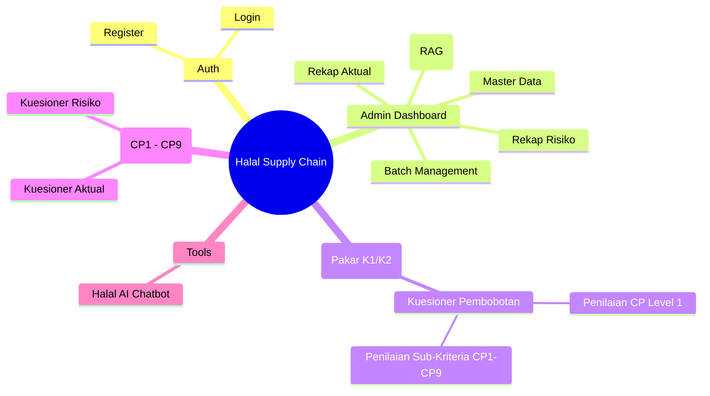
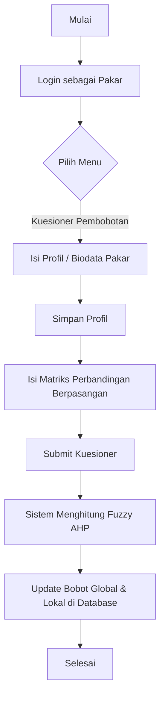
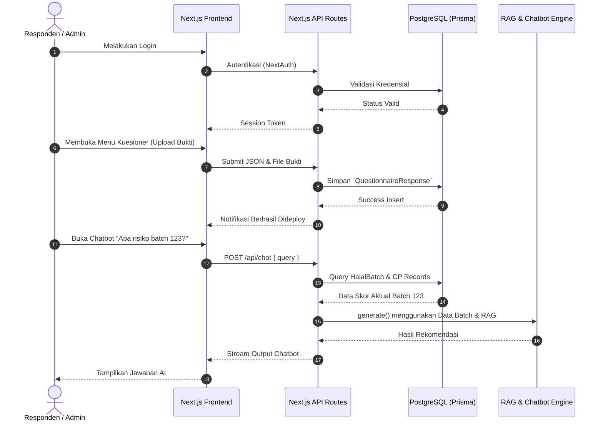
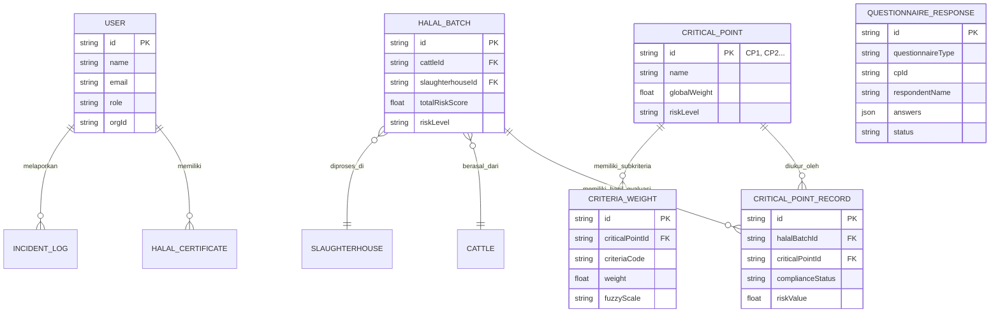

# User Guideline & System Architecture
**Sistem Informasi Manajemen Halal Supply Chain (KMS & DSS)**

Dokumen ini memuat panduan pengguna (User Guideline) sekaligus arsitektur sistem dari **Integrated Halal Supply Chain**, mencakup Diagram Navigasi, Entity Relationship Diagram (ERD), Sequence Diagram, dan Activity Diagram. Format ini diadaptasi dari struktur dokumen pedoman pengguna terstandar.

---

## 1. Diagram Navigasi (Navigation Diagram)

Diagram ini menggambarkan alur menu dari sisi antarmuka pengguna berdasarkan Hak Akses (Role).



---

## 2. Activity Diagram

### A. Activity Diagram: Pengisian Kuesioner & Perhitungan Bobot (Pakar)
Proses ini mirip dengan tahapan _Generate Bobot Fuzzy AHP_ oleh Pakar.



### B. Activity Diagram: Input Data Traceability & Aktual (Responden Lapangan)

```mermaid
flowchart TD
    A[Mulai] --> B[Login sebagai Responden (CP1-CP9)]
    B --> C[Buka Menu Kuesioner Aktual / Risiko]
    C --> D[Pilih ID Batch / Entitas]
    D --> E[Isi Formulir Kondisi Aktual Lapangan]
    E --> F[Upload Dokumen Pendukung (PDF/TXT/Excel)]
    F --> G[Simpan / Submit Data]
    G --> H[Sistem Mengkalkulasi Skor Risiko (DSS)]
    H --> I[Status Batch Terupdate (Low/Moderate/High/Critical)]
    I --> J[Selesai]
```

---

## 3. Sequence Diagram

Sequence Diagram berikut menunjukkan interaksi antara Pengguna, Antarmuka (Frontend), API Backend, dan Database (termasuk modul RAG Chatbot).



---

## 4. Entity Relationship Diagram (ERD)

ERD di bawah ini disederhanakan dari skema Prisma untuk menyoroti relasi inti antara Batch, Titik Kritis (CP), dan Kuesioner.



---
## Ringkasan Fitur
Sesuai format dari dokumen panduan aplikasi pengukur *behavior*, sistem **Halal Supply Chain** ini mengadopsi:
- **Hak Akses Admin:** Kontrol penuh atas Master Data, Rekapitulasi, dan manajemen Knowledge Base RAG.
- **Hak Akses Responden Pakar (Responden I):** Menggunakan Fuzzy AHP untuk membangkitkan (generate) matriks bobot kepentingan per Titik Kritis (CP).
- **Hak Akses Responden Lapangan (Responden II):** Mengumpulkan data dukung, file, excel/dokumen yang memicu kalkulasi Traceability pada DSS Halal.
